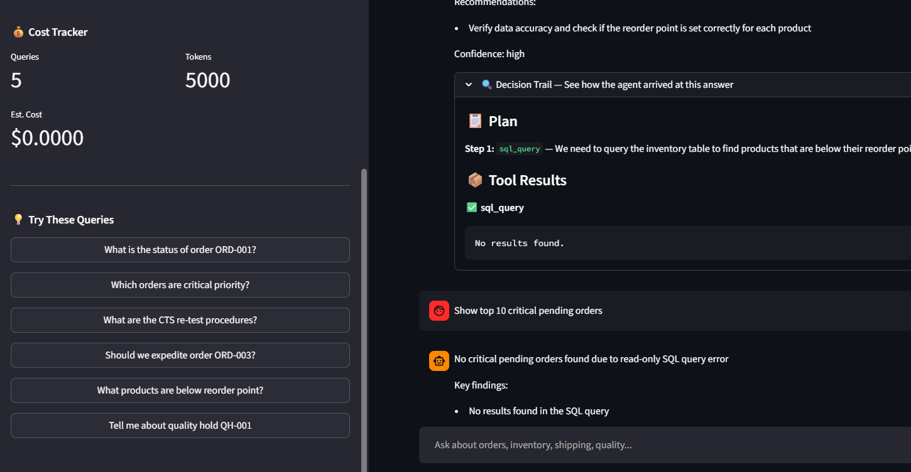

# Enterprise LLM Agent Platform with Tool Orchestration & RAG

An enterprise-grade AI agent platform that decomposes complex supply chain questions into multi-step plans, executes them using the right tools (SQL, document search, calculations), and returns grounded, actionable answers.

## Live App

- Check out the App here: [DEMO](https://logistiq---llm-orchestration-supply-chain-management-znowsvy9x.streamlit.app/)

## Keep Streamlit Awake (Every 12 Hours)

This repo includes a GitHub Actions workflow that pings your Streamlit app every 12 hours.

1. Go to your GitHub repo settings: `Settings -> Secrets and variables -> Actions`.
2. Add a repository secret named `STREAMLIT_APP_URL`.
3. Set it to your deployed app URL, for example:
      `https://logistiq---llm-orchestration-supply-chain-management-znowsvy9x.streamlit.app/`
4. Commit and push this repo. The workflow file is at:
      `.github/workflows/streamlit-keepalive.yml`
5. Optional: run it immediately from `Actions -> Streamlit Keep Alive -> Run workflow`.

Cron used: `0 */12 * * *` (every 12 hours, UTC).

## App Demo



## 🏗️ Architecture

```
User Query → Planner (Groq) → Plan [Step1, Step2, ...] → Executor
                                                              │
                                    ┌─────────────────────────┤
                                    ▼                         ▼
                              Tool Registry            Answer Synthesis
                              (Role-Based)                  (Groq)
                                    │
                    ┌───────────────┼───────────────┐
                    ▼               ▼               ▼
                SQL Tool       RAG Tool        Calculator
                (SQLite)    (ChromaDB+BM25)    (Python eval)
```

## 🚀 Quick Start

### 1. Install Dependencies
```bash
pip install -r requirements.txt
```

### 2. Set Up Environment
```bash
cp .env.example .env
# Edit .env and add your Groq API key from https://console.groq.com/keys
```

### 3. Initialize Database
```bash
python data/setup_database.py
```

### 4. Run the App
```bash
streamlit run ui/app.py
```

## Enterprise Data Mode (Large Dataset)

For enterprise-style scale, ingest the public Olist e-commerce dataset into the same
SQL schema used by the chatbot tools.

1. Download and extract the Olist CSV dataset into a local folder.
2. Run:

```bash
python data/load_enterprise_dataset.py --source-dir /path/to/olist_csv_folder --max-orders 100000
```

This keeps table names and columns unchanged, so existing tools continue to work:
- orders
- inventory
- shipments
- quality_holds

## 📁 Project Structure

```
LLM_Orchestration/
├── agent/              # Core agent brain
│   ├── schemas.py      # Pydantic data models (Plan, ToolCall, etc.)
│   ├── planner.py      # Task decomposition (query → plan)
│   ├── executor.py     # Plan execution (ReAct loop)
│   ├── memory.py       # Conversation memory (sliding window)
│   └── orchestrator.py # Wires everything together
├── tools/              # MCP-style plugin system
│   ├── base.py         # Abstract tool interface
│   ├── registry.py     # Plugin registry + RBAC
│   ├── sql_tool.py     # Database queries (read-only)
│   ├── rag_tool.py     # Document search
│   └── calculator_tool.py # Math & date calculations
├── rag/                # Retrieval-Augmented Generation pipeline
│   ├── loader.py       # Document loading & chunking
│   ├── vectorstore.py  # ChromaDB + embeddings
│   └── retriever.py    # Hybrid retrieval (dense + sparse)
├── evaluation/         # Testing & monitoring
│   └── cost_tracker.py # Token usage & cost tracking
├── data/               # Sample data
│   ├── setup_database.py
│   ├── supply_chain.db
│   └── documents/      # SOPs, policies, manuals
├── ui/
│   └── app.py          # Streamlit demo interface
└── tests/              # Automated tests
```

## 🔑 Key Features

- **Planner-Executor Architecture**: Decomposes complex queries into multi-step plans
- **RAG Pipeline**: Hybrid retrieval (vector + BM25) over internal documents
- **MCP-Style Plugin System**: Standardized tool interface with role-based access control
- **Cost Tracking**: Token usage and cost monitoring per query
- **Decision Trail**: Full transparency into agent reasoning and tool calls

## 📊 Tech Stack

| Component | Technology |
|-----------|-----------|
| LLM | Groq-hosted OSS model (free tier available) |
| Embeddings | sentence-transformers (local, free) |
| Vector DB | ChromaDB |
| Database | SQLite |
| Agent Framework | LangChain |
| UI | Streamlit |
| Validation | Pydantic |
