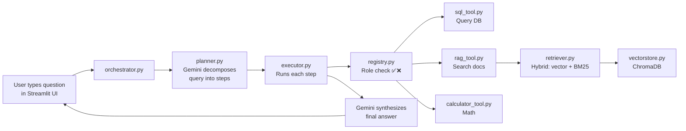

# Walkthrough — LLM Agent Platform Build

## What Was Built

The entire project is now in `c:\Users\Lenovo\Desktop\LLM_Orchestration\` — **20 files** across 7 packages.

### Component Map (how data flows)



### Files Created

| Package | File | Purpose |
|---------|------|---------|
| `config/` | [settings.py](file:///c:/Users/Lenovo/Desktop/LLM_Orchestration/config/settings.py) | Pydantic settings from `.env` |
| `agent/` | [schemas.py](file:///c:/Users/Lenovo/Desktop/LLM_Orchestration/agent/schemas.py) | Data contracts (Plan, ToolCall, StepResult) |
| `agent/` | [planner.py](file:///c:/Users/Lenovo/Desktop/LLM_Orchestration/agent/planner.py) | Query → multi-step plan via Gemini |
| `agent/` | [executor.py](file:///c:/Users/Lenovo/Desktop/LLM_Orchestration/agent/executor.py) | ReAct loop — runs plan, synthesizes answer |
| `agent/` | [memory.py](file:///c:/Users/Lenovo/Desktop/LLM_Orchestration/agent/memory.py) | Sliding-window conversation memory |
| `agent/` | [orchestrator.py](file:///c:/Users/Lenovo/Desktop/LLM_Orchestration/agent/orchestrator.py) | Wires all components together |
| `tools/` | [base.py](file:///c:/Users/Lenovo/Desktop/LLM_Orchestration/tools/base.py) | Abstract tool interface (MCP-style) |
| `tools/` | [registry.py](file:///c:/Users/Lenovo/Desktop/LLM_Orchestration/tools/registry.py) | Plugin registry + role-based access |
| `tools/` | [sql_tool.py](file:///c:/Users/Lenovo/Desktop/LLM_Orchestration/tools/sql_tool.py) | Read-only SQL queries |
| `tools/` | [rag_tool.py](file:///c:/Users/Lenovo/Desktop/LLM_Orchestration/tools/rag_tool.py) | Document search wrapper |
| `tools/` | [calculator_tool.py](file:///c:/Users/Lenovo/Desktop/LLM_Orchestration/tools/calculator_tool.py) | Safe math & date calculations |
| `rag/` | [loader.py](file:///c:/Users/Lenovo/Desktop/LLM_Orchestration/rag/loader.py) | Document loading + chunking |
| `rag/` | [vectorstore.py](file:///c:/Users/Lenovo/Desktop/LLM_Orchestration/rag/vectorstore.py) | ChromaDB + local embeddings |
| `rag/` | [retriever.py](file:///c:/Users/Lenovo/Desktop/LLM_Orchestration/rag/retriever.py) | Hybrid: dense + BM25 with RRF fusion |
| `evaluation/` | [cost_tracker.py](file:///c:/Users/Lenovo/Desktop/LLM_Orchestration/evaluation/cost_tracker.py) | Token usage + cost logging |
| `data/` | [setup_database.py](file:///c:/Users/Lenovo/Desktop/LLM_Orchestration/data/setup_database.py) | Creates SQLite DB with sample data |
| `data/documents/` | 4 markdown files | CTS procedures, SLA, expedite policy, quality manual |
| `ui/` | [app.py](file:///c:/Users/Lenovo/Desktop/LLM_Orchestration/ui/app.py) | Streamlit chat interface |

## How to Run

```bash
# 1. Install
cd c:\Users\Lenovo\Desktop\LLM_Orchestration
pip install -r requirements.txt

# 2. Set up .env (copy example and add your Gemini key)
copy .env.example .env
# Edit .env → put your Gemini API key

# 3. Create the database
python data/setup_database.py

# 4. Launch
streamlit run ui/app.py
```

> Get your free Gemini key at: https://aistudio.google.com/app/apikey

## Every File Has Detailed Comments

Each file starts with a **WHY THIS EXISTS** block explaining the engineering reasoning, not just the what. Read through them — they're your interview prep material.
